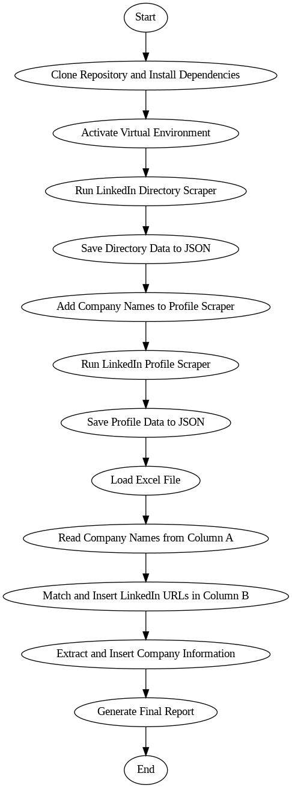

<!DOCTYPE html>
<html lang="en">
<head>
    <meta charset="UTF-8">
    <meta name="viewport" content="width=device-width, initial-scale=1.0">
    <h1>LinkedIn Data Enrichment Proposal</h1>
</head>
<body>
    <h1>Hi there!</h1>My name is Santiago Moreno and I'm thrilled to have the opportunity to propose a solution for enriching your IT provider database with LinkedIn data. I've carefully reviewed your project requirements and I'm confident that my skills and experience make me the perfect fit for this job.
    
<h2>Methodology:</h2>
    <ul>My approach is to utilize the LinkedIn Company Data Scraping System, as you suggest, to enrich your IT provider database with LinkedIn information. We'll clone the repository first, then navigate to the appropriate folders. Next, we will collect firm names and URLs using the LinkedIn firm Directory Scraper. Finally, we will extract detailed company information using the LinkedIn Company Profile Scraper. As seen in the flowchart that goes with it, this procedure should guarantees that LinkedIn data is integrated into your database without any problems.</ul>

  

    <h2>Flowchart:</h2>
    
    
Flowchart: LinkedIn Data Enrichment Process

  

</body>
</html>
